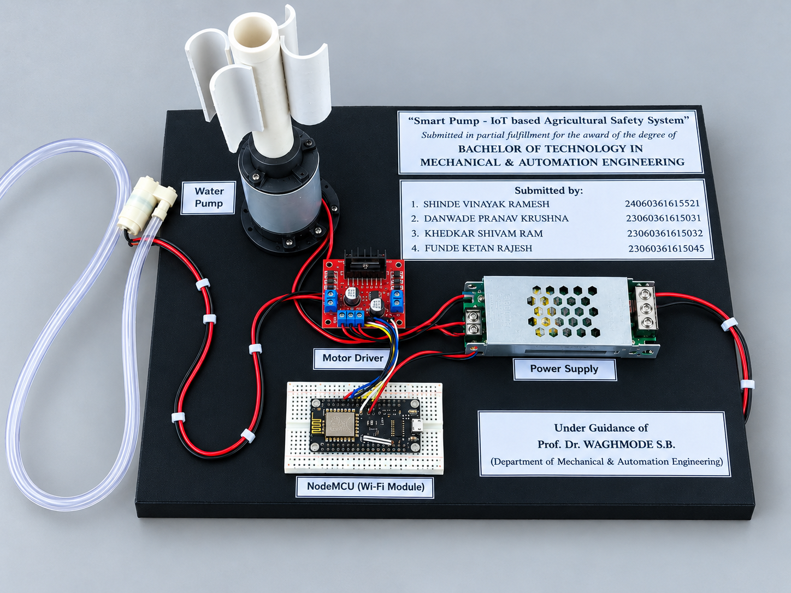

# 🌱 Smart Pump – IoT Based Agricultural Safety System

> An IoT-enabled agricultural pumping system integrating automated pump control, renewable wind energy, remote monitoring, and pump safety protection.

## 📌 Project Overview

The **Smart Pump – IoT Based Agricultural Safety System** is a B.Tech project developed in the **Department of Mechanical & Automation Engineering**.

The system combines an **ESP8266 NodeMCU controller, water pump, L298N motor-driver module, IoT communication, electrical power supply, and wind-turbine-based renewable energy** to develop a smarter and safer agricultural pumping solution.

The project is designed to reduce manual intervention, electricity dependency, and pump-related failures while enabling remote monitoring and automatic protection.

---

## 🎯 Objectives

- Automate agricultural water-pump operation.
- Enable IoT-based remote monitoring and control.
- Integrate wind energy as a renewable/alternative power source.
- Protect the pump against unsafe operating conditions.
- Reduce dependence on conventional electricity.
- Improve energy efficiency and operational reliability.
- Develop a practical low-cost smart pumping prototype.

---

## ⚙️ System Architecture

```text
             ┌───────────────────┐
             │   Electrical      │
             │   Power Supply    │
             └─────────┬─────────┘
                       │
                       ▼
             ┌───────────────────┐
             │  Power Management │
             └─────────┬─────────┘
                       │
┌──────────────┐       ▼
│ Wind Turbine │──► Power System
└──────────────┘       │
                       ▼
              ┌─────────────────┐
              │ ESP8266 NodeMCU │
              │   Controller    │
              └───────┬─────────┘
                      │
             ┌────────┴────────┐
             ▼                 ▼
       IoT Monitoring     Safety Logic
             │                 │
             └────────┬────────┘
                      ▼
              ┌─────────────────┐
              │  L298N Motor    │
              │     Driver      │
              └────────┬────────┘
                       ▼
                ┌─────────────┐
                │ Water Pump  │
                └──────┬──────┘
                       ▼
                Water Delivery
```

---

## 🔄 Working Principle

1. The system receives power from the conventional electrical supply and/or the wind-turbine power source.
2. The ESP8266 NodeMCU initializes the control system.
3. Sensors provide information about system conditions.
4. The controller evaluates the operating conditions.
5. If the conditions are safe, the pump is operated through the motor-driver circuit.
6. Pump/system information is communicated through Wi-Fi to the IoT monitoring platform.
7. If an unsafe condition is detected, the safety logic can stop the pump automatically.
8. The system enables remote monitoring and control.

---

## 🛡️ Safety Features

The project incorporates protection against:

- Dry running
- Water overflow
- Motor overload
- Voltage fluctuations
- Motor overheating

These protection functions are intended to improve pump reliability, reduce equipment damage, and increase motor life.

---

## 🔋 Dual Power System

One of the major features of the project is the integration of two power sources.

### Conventional Electrical Supply

Provides the primary electrical power required for system operation.

### Wind Turbine

Provides renewable electrical energy and can act as an alternative/backup power source.

The combination is intended to reduce dependence on conventional electricity and improve system availability.

---

## 📡 IoT & Wireless Communication

The project uses the **ESP8266 NodeMCU** as the primary controller.

The controller provides the interface between the IoT/control logic and the motor-driving circuit.

The IoT system is designed for:

- Remote pump monitoring
- Pump status monitoring
- Water-level monitoring
- Power-condition monitoring
- Fault-condition monitoring
- Remote operation

---

## 🧰 Hardware Components

| Component | Quantity | Purpose |
|---|---:|---|
| ESP8266 NodeMCU | 1 | Main controller & Wi-Fi communication |
| Mini Water Pump | 1 | Water transfer |
| L298N Motor Driver | 1 | Pump motor control |
| Wind Turbine | 1 | Renewable energy generation |
| SMPS Power Supply | 1 | DC power supply |
| Breadboard | 1 | Circuit assembly |
| Connecting Wires | Several | Electrical connections |
| Pipes | 1 Set | Water transportation |

---

## 💻 Software & Technologies

- Arduino IDE
- Embedded C
- ESP8266 / NodeMCU
- Wi-Fi communication
- IoT dashboard monitoring
- Motor control
- Embedded system design

---

## 🧠 Program Flow

```text
Start
  ↓
Initialize System
  ↓
Connect to Wi-Fi
  ↓
Read Sensor Data
  ↓
Check Safety Conditions
  ↓
Safe?
 ┌───────┴───────┐
Yes              No
 ↓                ↓
Operate Pump   Stop Pump
 ↓                ↓
Send Data to IoT Dashboard
  ↓
Monitor Continuously
```

---

## 📊 Results

The project prototype demonstrated:

- Pump operation using electrical power.
- Wind-turbine-assisted power generation.
- IoT communication.
- Remote monitoring.
- Automatic protection during unsafe conditions.
- Automated pump operation.

The project demonstrated the integration of **IoT, renewable energy, automation, and safety monitoring** in an agricultural pumping application.

---

## 💰 Project Cost

| Component | Cost (₹) |
|---|---:|
| NodeMCU ESP8266 | 700 |
| Water Pump | 450 |
| Motor Driver | 400 |
| Wind Turbine Setup | 1500 |
| SMPS | 400 |
| Breadboard & Wires | 350 |
| Pipes & Accessories | 200 |
| Miscellaneous | 600 |
| **Total** | **₹4,600** |

---

## 🌾 Applications

- Agricultural irrigation
- Rural water supply
- Remote-area pumping
- Smart farming
- Domestic water supply
- Small industrial pumping systems
- Rural water management

---

## 🚀 Future Scope

Future development can include:

- Solar-energy integration
- AI-based predictive maintenance
- Cloud computing
- GSM communication
- Dedicated mobile application
- Improved energy storage
- Advanced sensor integration
- Large-scale agricultural deployment

---

## 🎓 Academic Project

**Project Title:** Smart Pump – IoT Based Agricultural Safety System

**Degree:** Bachelor of Technology

**Department:** Mechanical & Automation Engineering

**Institute:** Government College of Engineering, Kolhapur

**Academic Year:** 2025–26

### Project Team

- Shinde Vinayak Ramesh
- Danwade Pranav Krushna
- Khedkar Shivam Ram
- Funde Ketan Rajesh

### Project Guide

Prof. Dr. Waghmode S.B.

---

## 📷 Prototype

### Project Prototype



---

## 📂 Recommended Repository Structure

```text
smart-pump-iot-agricultural-safety-system/
│
├── README.md
├── images/
│   ├── prototype-front.jpg
│   ├── prototype-side.jpg
│   ├── prototype-top.jpg
│   └── prototype-with-report.jpg
├── code/
│   └── smart_pump.ino
├── circuit/
│   └── circuit-diagram.png
└── documentation/
    └── project-report.pdf
```

---

## 📚 Documentation

The complete project report can be included in the `documentation/` directory.

---

### ⭐ Keywords

`IoT` `ESP8266` `NodeMCU` `Smart Agriculture` `Agricultural Automation` `Water Pump` `Renewable Energy` `Wind Turbine` `Embedded Systems` `Motor Control` `Smart Irrigation`
